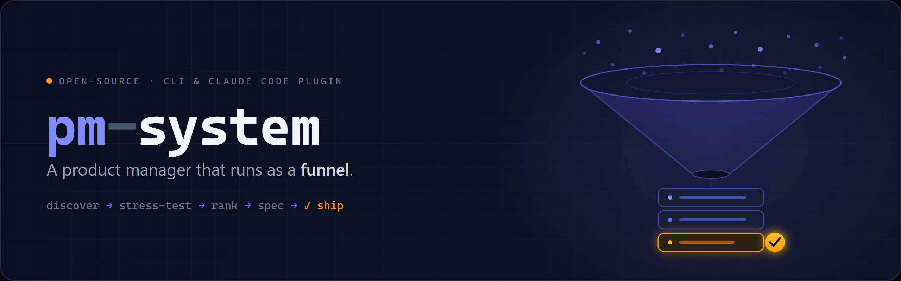

<p align="center">
  
</p>

# pm-system

**A product manager that runs as a funnel.** Point it at an open-source target and it
finds opportunities, tries to kill the weak ones, ranks the survivors by value-per-effort,
drafts the good ones into requirements, and waits for your approval before anything ships.

```bash
# Install the skills (Claude Code)
/plugin marketplace add dkedar7/pm-system

# Install the CLI (the human-first surface)
uv tool install ./pmkit        # or: pip install ./pmkit
```

## 30-second demo

```bash
pmkit discover langchain-ai/langchain      # ingest signals → candidate opportunities
/pm-run langchain-ai/langchain             # discover → kill-test → rank (stops at the gate)
pmkit backlog list --status survived --sort score
pmkit backlog show 7                       # scores, provenance, category
pmkit backlog approve 7                    # the hard human gate → delegates to implementation
```

Zero config to start: GitHub, Hacker News, and web search work immediately. X, Reddit, and
the scraper sources unlock when you add keys — every source is optional and the engine
degrades gracefully to what it can reach.

## How it works

```
discover ──► stress-test (kill-test panel) ──► rerank (RICE) ──► spec ──► [human gate] ──► delegate
   │                                                                                          │
   └──────────────────────── persistent opportunity backlog (SQLite) ◄───────────────────────┘
```

Four stages over one persistent, deduplicated backlog:

1. **Discover** — multi-source OSS signals (GitHub issues/PRs, HN, Reddit, X, changelogs,
   competitor repos, docs gaps), each candidate carrying its sources.
2. **Stress-test & rerank** — an adversarial panel tries to *refute* each candidate
   (already-solved, pain-is-rare, infeasible, won't-be-adopted); survivors are ranked by a
   RICE-style value-per-effort score.
3. **Spec** — survivors become requirements docs. Each product is tagged `agent-only` or
   `human-and-agent`; human-and-agent products are required to ship a human-first interface
   (CLI/UI/slash) with full human↔agent parity.
4. **Gated delegate** — nothing reaches implementation without your approval. On approval,
   the spec is handed to `ce-plan` / `lfg`.

## Components

| Component | Category | Surface |
|---|---|---|
| `pmkit discover` / `pmkit backlog` | human-and-agent | CLI |
| `pm-spec` (category-aware drafting) | human-and-agent | skill |
| kill-test panel, RICE reranker, delegation orchestrator | agent-only | internal |

## License

MIT
